# Architecture in diagrams

This document is a **view**, not a source of truth. The contracts live in
`05-agent-swarm.md`, the behaviour lives in `tools/swarm/swarm/`. Where a
diagram and the code disagree, the code is right and the diagram is a bug.

Diagrams are drawn against the code as of 2026-08-23 (design doc v0.50).
Section references are to `05-agent-swarm.md`.

---

## 1. Roles and the state they touch

Three expensive roles on strong models, one authoring role, one cheap third
circuit, and a single dumb process holding them together. The orchestrator
contains no LLM: all judgement is in the agents, all mechanics are in the
orchestrator (§3).

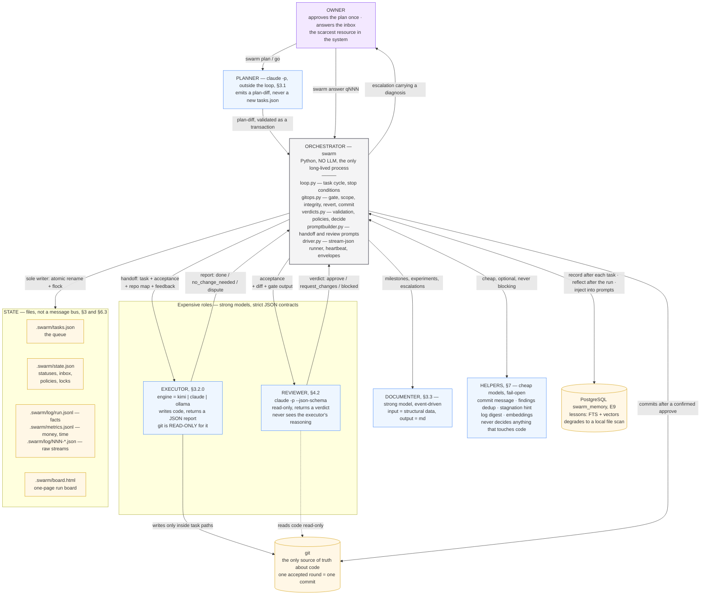

Two asymmetries carry most of the design's weight:

- **The reviewer never sees the executor's reasoning** — only requirements,
  the diff and the gate output. Otherwise it catches the same false
  assumptions and the second model stops being a second opinion (§3).
- **`.swarm/` is deliberately outside git** (`.git/info/exclude`, §6.3): git
  stores the *result*, not the run's state — using it as a state bus breaks
  atomic access to the queue.

---

## 2. Task state machine

Statuses are the queue's contract (§4.3). The interesting part is not the
happy path but the named reasons a task lands in `blocked`: each one has its
own escalation text, because "blocked" alone leaves the operator in the dark
(§4.2, §5.7).

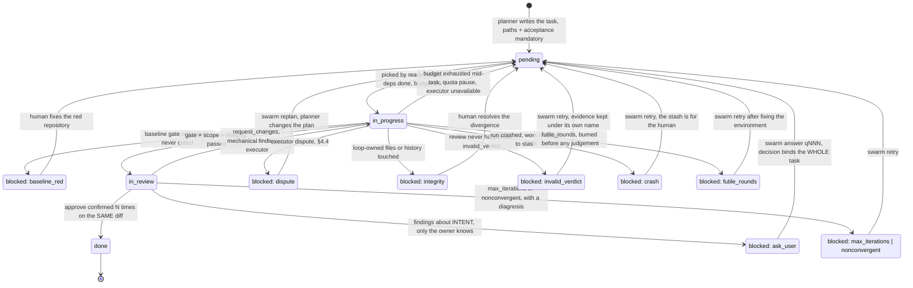

`pending` is not a failure state: a task stopped by budget, quota or a dead
executor is **not at fault**, its work goes to a stash and the queue resumes
with the same `go` (§5.3).

---

## 3. The gate chain — one round, in the real order

This is the spine of the system: an ordered chain of **mechanical** checks
around two model calls. Order is not decorative — each check exists to keep
the next one from judging the wrong thing (`loop.run_task`).

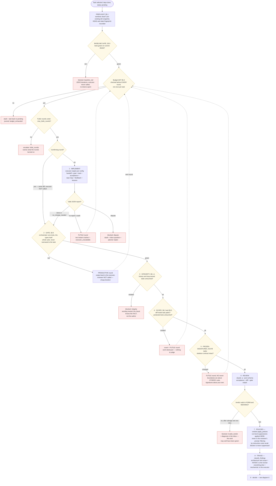

Three properties worth stating in words, because a diagram hides them:

- **The gate runs the whole suite.** Narrowing it to the current task's tests
  is the only way to miss a regression in a neighbouring module (§5.0).
- **A gate failure is cheap.** The reviewer is not called at all; the executor
  gets the test output straight back.
- **A confirming round does not call the executor.** It is a *second reading
  of the same diff*, not another lap of work (§5.7, `loop.run_task`).

---

## 4. What a round is charged to — productive vs futile

The most counter-intuitive rule in the loop, and the one measured hardest:
**only a round that reached a mechanical judgement spends the fix budget**
(§5.3). A round that collapsed earlier judged nothing, and charging it made
the loop announce "rounds exhausted" about work no one had ever looked at.

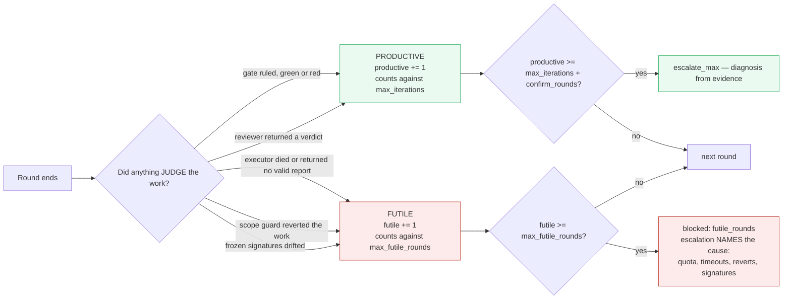

The diagnosis attached to an escalation walks a **closed list of mechanical
evidence**, most precise first (`reviewcycle._diagnose`, §5.7.0):

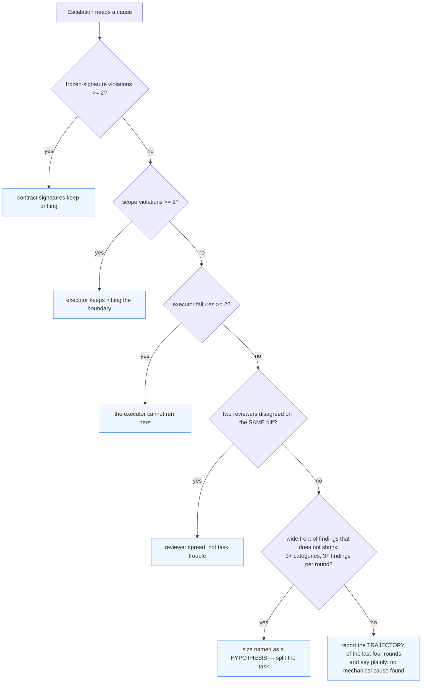

The old fallback — "rounds exhausted, the task is probably too large" — was
wrong six times out of six on the frozen gold set, and each time it sent the
owner to split a task whose real trouble was elsewhere.

---

## 5. One round as a conversation

The same round as diagram 3, but showing **who holds what** at each moment.
Note where the two model calls sit and how little each of them is told.

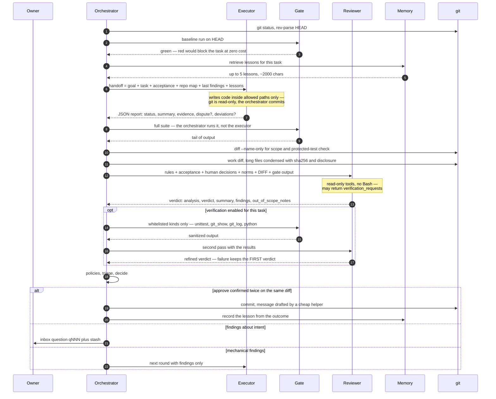

---

## 6. The verdict contract — form, meaning, rescue

A verdict is the only thing that can close a task, so its failure modes get
their own machinery (§4.2, §4.2.1). Measured on E13: **5 reviewer calls out of
17 returned no valid verdict and burned 37 % of all review money.**

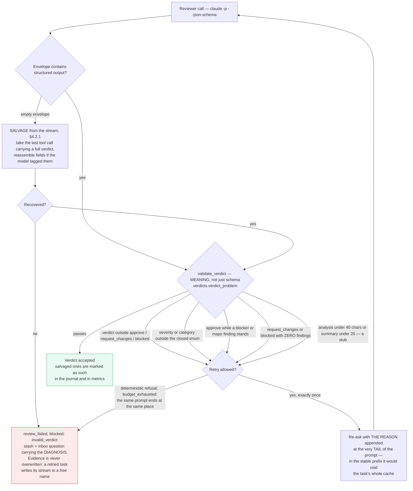

Then `decide()` turns an accepted verdict into an outcome
(`verdicts.decide`), in this order:

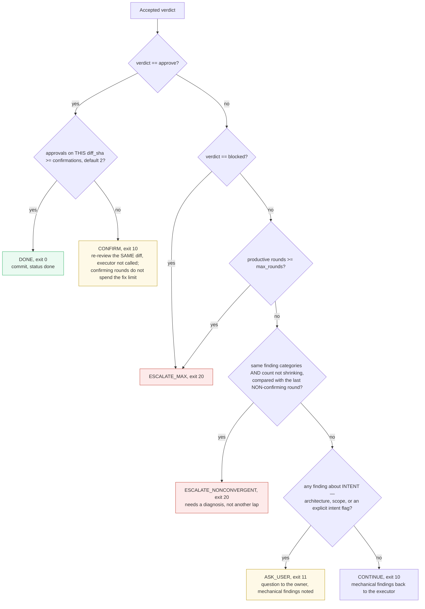

Approvals are counted **per diff hash**, not per task: an approve earned
before a later fix belongs to a different diff and does not count. Without
that rule a chain of approve → flip → fix → approve closed tasks whose final
code exactly one reviewer had ever seen.

Between rounds the loop also keeps the **best** round (fewest findings) and
rolls back to it if the next one is worse — but never on a confirming round,
where a change in finding count is reviewer spread, not regression.

---

## 7. Context flow — who is told what, and in which order

Context is a budget, not a courtesy (§8). Two rules shape every prompt: the
**asymmetry** that keeps the reviewer independent, and the **cache prefix**
that decides what a call costs.

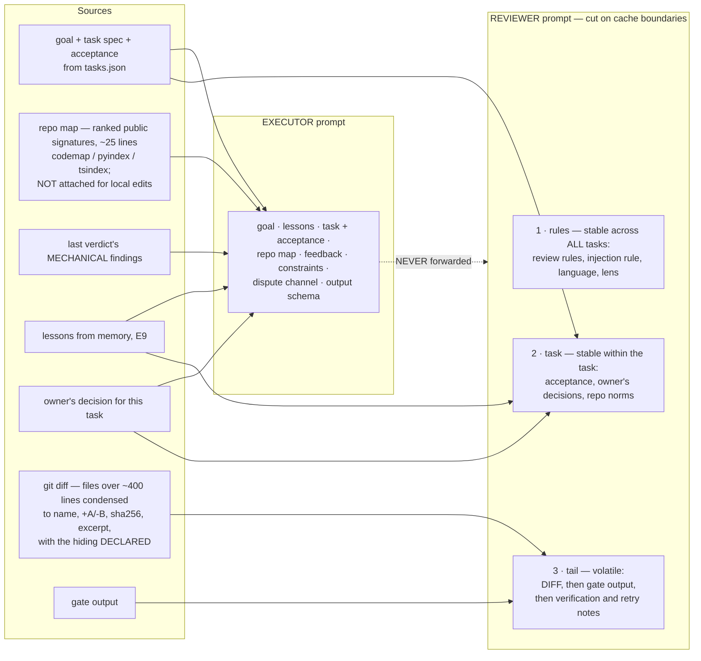

- **The executor never receives** previous handoffs or its own past
  reasoning; **the reviewer never receives** the executor's report. The dotted
  edge is the one that must stay severed (§3, §8).
- **Block order is money.** Prompt caching matches on a *prefix*: the first
  differing byte voids everything after it, a write costs twice the input
  rate, a read a tenth of it. Hence stable → task-stable → volatile, with the
  diff placed *before* the gate output because it is the largest block and
  must not sit behind anything that changes between rounds.
- **Reviewer hands are drawn by lottery** per call from
  `review_model_pool` / `review_effort_pool`, recorded in metrics
  (`swarm ab`). Because every task is reviewed twice on the same diff, the
  per-call draw produces "two hands on one diff" comparisons for free (§8.2).

---

## 8. Where the human is asked, and how the answer travels back

The loop is an autopilot with a **named** list of escalations (§1.1). The
scarcest resource in the system is the owner's attention, so the triage rule
is explicit: of 6–7 findings per task, 1–2 reach the human (§5.7).

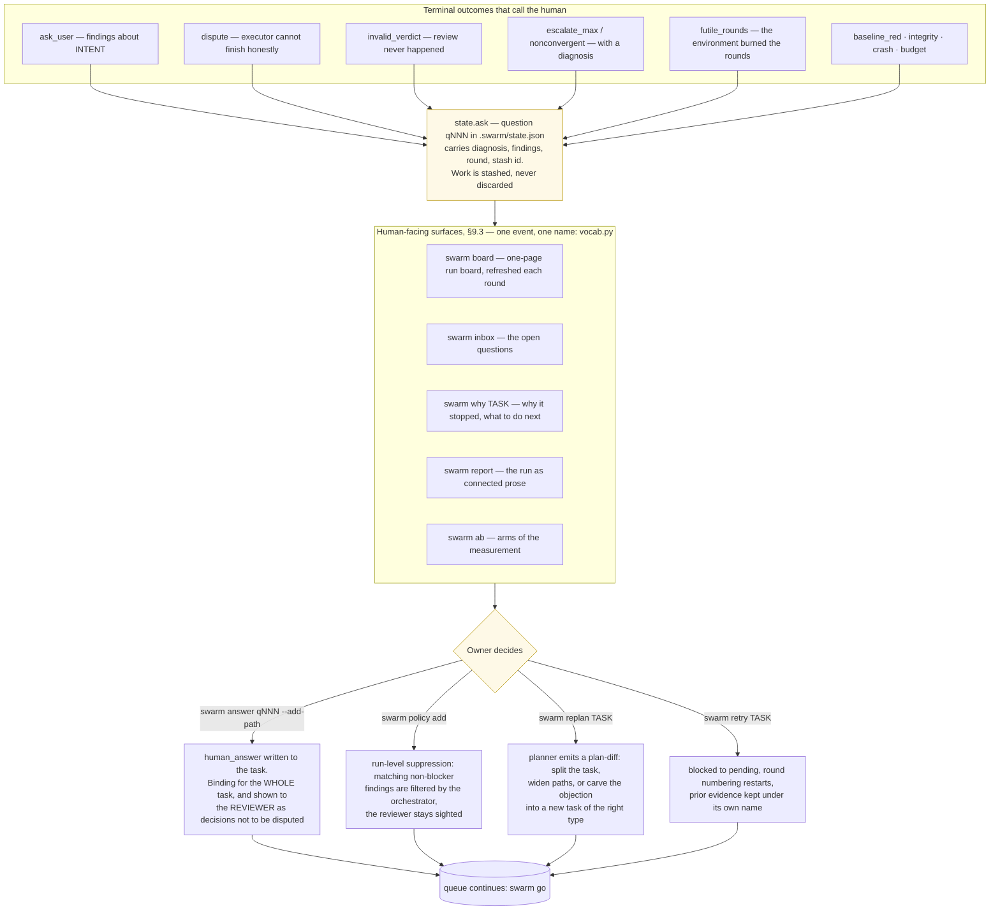

The rule the pilot paid for: **an escalation must carry a diagnosis.** A task
that goes to `blocked` with no journal entry and no question leaves the
operator blind — the work may have been finished and green, with only the
review having failed (§4.2).

---

## 9. Memory between runs (E9)

Memory is an **observation**, not part of the work: its failure leaves a trace
and never costs a run. Every path degrades — Postgres to a local file scan,
retrieval to nothing at all.

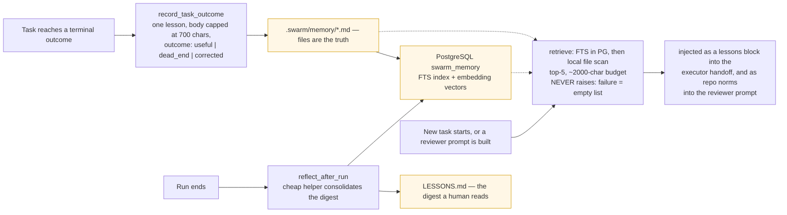

Measured effect (E9, planner arm): with memory, a replan folded all three of
the owner's decisions into named tasks, including a satellite inherited from
a different dispute; without memory that satellite was lost in every replan.

---

## 10. Failure ladder: quota, crashes, liveness

Every one of these branches exists because the loop once mistook one kind of
failure for another and charged the wrong party (§5.2, §5.3).

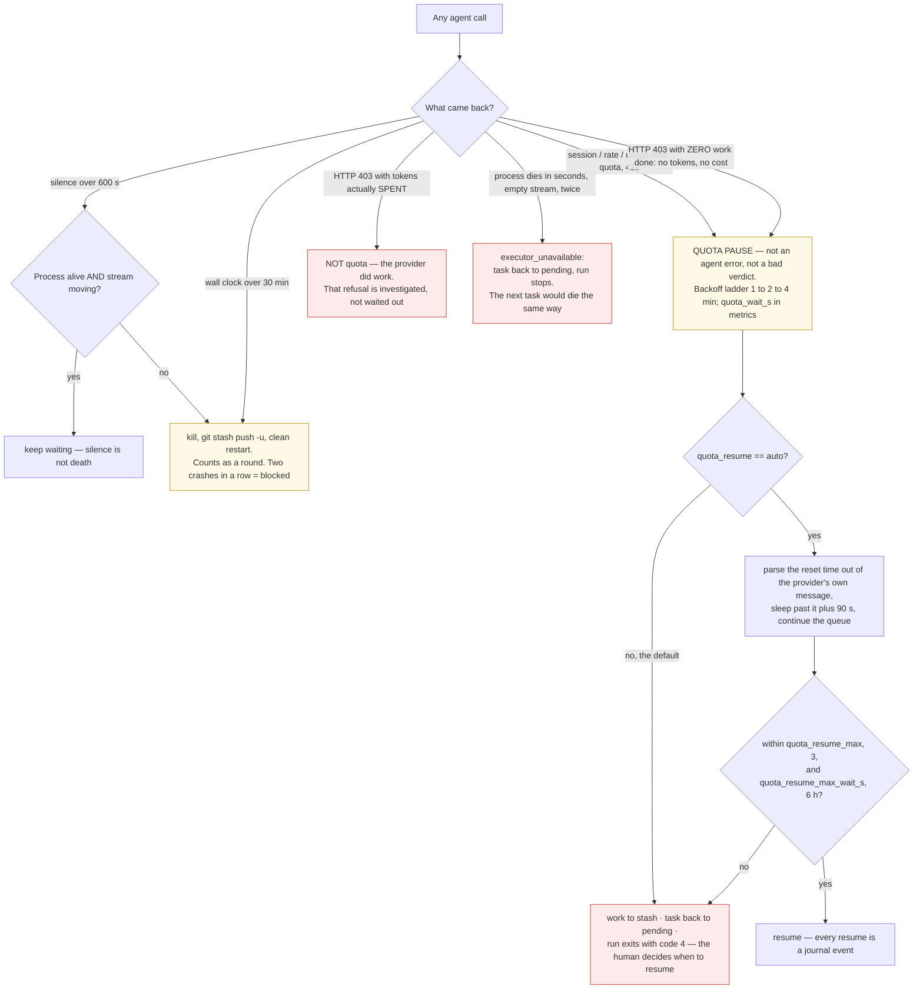

The same defect class — "a refusal by quota looks like a bad answer" — has
been fixed three times at three different levels. It is worth reading the
branches above as scar tissue, not as configuration.

---

## 11. CLI surface

One entry point, `swarm`; the commands map onto the subsystems above (§9.2).

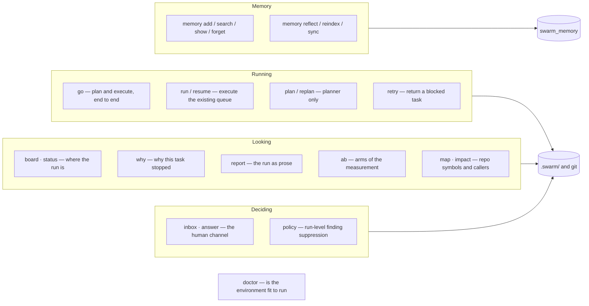

---

## Change log

### v0.1 (2026-08-23)

First edition. Eleven Mermaid views drawn from `05-agent-swarm.md` v0.50 and
from the implementation in `tools/swarm/swarm/` (`loop.run_task`,
`verdicts.decide`, `gitops`, `reviewer`, `promptbuilder`, `helpers`,
`meminject`). Written in English per the owner's standing rule for new
documents; the surrounding Russian documents are untouched.
