# Architecture in diagrams

This document is a **view**, not a source of truth. The contracts live in
`05-agent-swarm.md`, the behaviour lives in `tools/swarm/swarm/`. Where a
diagram and the code disagree, the code is right and the diagram is a bug.

Diagrams are drawn against the code as of 2026-08-23 (design doc v0.50).
Section references are to `05-agent-swarm.md`.

## How to read these diagrams

Shape and colour mean the same thing in every figure below. Nothing else is
decorative: a box is a thing that acts, a **diamond is a check the
orchestrator performs itself** — no model, no money, just code looking at
files — and a cylinder is state that survives the process.

```mermaid
%%{init:{"theme":"base","themeVariables":{"fontFamily":"ui-sans-serif,system-ui,-apple-system,Segoe UI,Roboto,sans-serif","fontSize":"15px","primaryColor":"#EFEAF8","primaryTextColor":"#1A1726","primaryBorderColor":"#7A5CB8","lineColor":"#9A93B0","edgeLabelBackground":"#FFFFFF","clusterBkg":"#F8F6FC","clusterBorder":"#D8D0EA"},"flowchart":{"diagramPadding":26,"curve":"linear","nodeSpacing":26,"rankSpacing":70,"padding":12}}}%%
flowchart TB
    a["<b>MODEL CALL</b><br/>an agent runs · money is spent"]:::agent
    b{"<b>CHECK</b><br/>no model"}:::check
    c["<b>LOOP CODE</b><br/>the orchestrator itself"]:::mech
    d["<b>HUMAN</b><br/>the scarcest resource"]:::person
    e[("<b>STATE</b><br/>survives the process")]:::store
    f["<b>CLOSED</b><br/>task done, committed"]:::good
    g["<b>STOPPED</b><br/>a human is needed"]:::bad

    classDef agent fill:#E8F0FE,stroke:#3B6FD4,stroke-width:1.5px,color:#12233F
    classDef mech fill:#FFFFFF,stroke:#4A2E78,stroke-width:2.5px,color:#1A1726
    classDef check fill:#FFF4D6,stroke:#D19A00,stroke-width:1.5px,color:#3A2C05
    classDef store fill:#F4EFE4,stroke:#9C8455,stroke-width:1.5px,color:#33291A
    classDef person fill:#F3E8FF,stroke:#7C3AED,stroke-width:2px,color:#2A1149
    classDef good fill:#E4F6EA,stroke:#2F8F5F,stroke-width:1.5px,color:#0F3D24
    classDef bad fill:#FDECEA,stroke:#C2453B,stroke-width:1.5px,color:#4A130E
```

Two conventions keep the figures readable. Edge labels are **never
sentences** — the words on a line name the thing being handed over
(`plan-diff`, `verdict`, `commit`), and the reasoning lives in the prose
beside the figure. A sentence parked on a long edge drifts to the middle of
the drawing and stops belonging to anything. And a chain is drawn **left to
right** while it still fits the page that way; the one chain that does not,
the round itself (§4), runs top to bottom, because a page scrolls downward
anyway.

---

## 1. Roles and the state they touch

Three expensive roles on strong models, one authoring role, one cheap third
circuit, and a single dumb process holding them together. The orchestrator
contains no LLM: all judgement is in the agents, all mechanics are in the
orchestrator (§3).

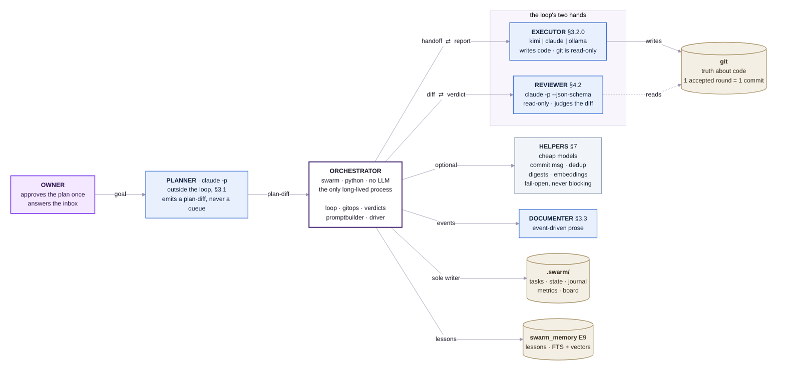

Two asymmetries carry most of the design's weight:

- **The reviewer never sees the executor's reasoning** — only requirements,
  the diff and the gate output. Otherwise it catches the same false
  assumptions and the second model stops being a second opinion (§3).
- **`.swarm/` is deliberately outside git** (`.git/info/exclude`, §6.3): git
  stores the *result*, not the run's state — using it as a state bus breaks
  atomic access to the queue.

The commit arrow is missing from the figure on purpose: the orchestrator
writes to git only through the commit step of a closed round, which is the
last node of figure 4.

---

## 2. Task status, and the reason it stopped

Statuses are the queue's contract (§4.3). The happy path is three
transitions wide; everything interesting is in *why* a task leaves it.

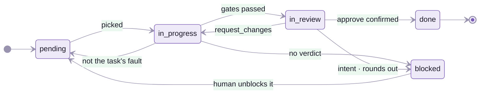

`pending` is not a failure state. A task stopped by budget, quota or a dead
executor is **not at fault**: its work goes to a stash and the queue resumes
with the same `go` (§5.3). Only `blocked` means the loop wants a human — and
it always names which of these it is, because "blocked" alone leaves the
operator in the dark (§4.2, §5.7).

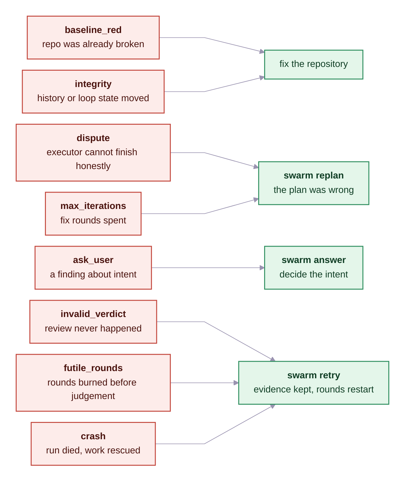

---

## 3. The frame around one task

Before any round runs, two checks decide whether the loop is allowed to
start at all — and they are the cheapest checks in the system, because
neither spends a token.

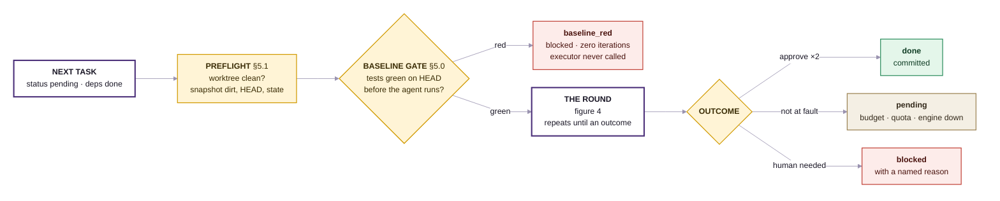

A red baseline blocks the task at **zero cost**: the executor is never
called, so the run does not pay for a repository that was already broken.
Without this rule one unfinished task poisons the whole queue — in BENCH-2 a
single red test sent four tasks into dispute and burned eight executor calls
for nothing (§5.0).

---

## 4. Inside one round — the gate chain

This is the spine of the system: an ordered chain of **mechanical** checks
around two model calls. Read the numbered spine downward; every branch that
leaves it to the side ends the round early (`loop.run_task`).

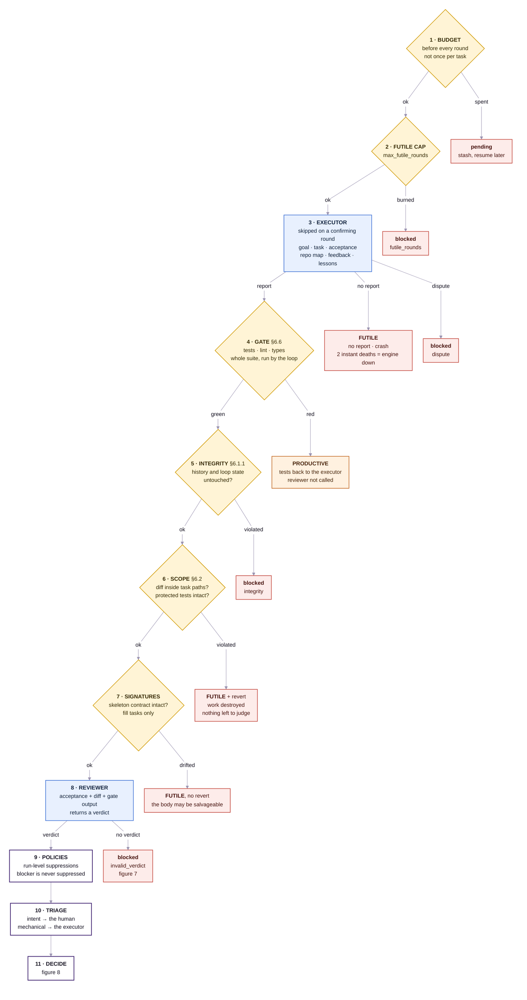

Three properties worth stating in words, because the drawing hides them:

- **The gate runs the whole suite.** Narrowing it to the current task's tests
  is the only way to miss a regression in a neighbouring module (§5.0).
- **A gate failure is cheap.** The reviewer is not called at all; the executor
  gets the test output straight back and the round costs one call, not two.
- **A confirming round skips step 3 entirely.** It is a *second reading of the
  same diff*, not another lap of work, so the executor cannot quietly change
  the code the second opinion is about.

---

## 5. What a round is charged to

The most counter-intuitive rule in the loop, and the one measured hardest:
**only a round that reached a mechanical judgement spends the fix budget**
(§5.3). A round that collapsed earlier judged nothing, and charging it made
the loop announce "rounds exhausted" about work no one had ever looked at.

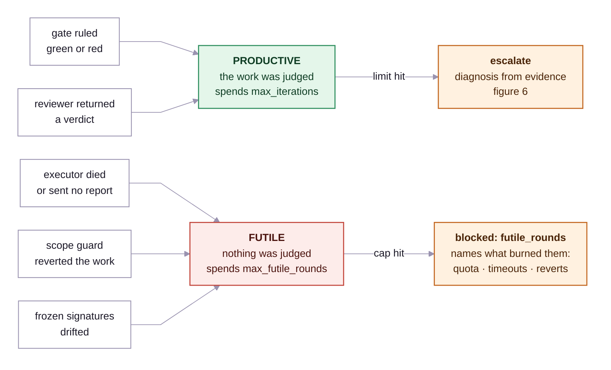

---

## 6. The diagnosis attached to an escalation

An escalation carries a hypothesis about the cause — but a hypothesis nobody
checks decays into a slogan. `_diagnose` walks a **closed list of mechanical
evidence**, most precise first, and stops at the first one that fires
(§5.7.0).

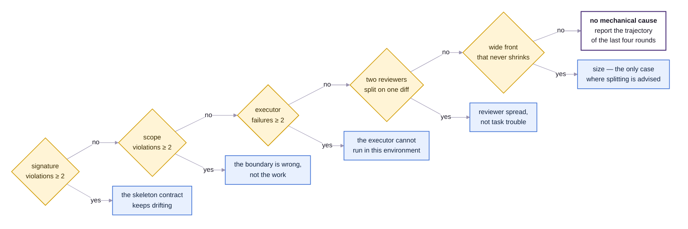

The old fallback — "rounds exhausted, the task is probably too large" — was
wrong six times out of six on the frozen gold set, and each time it sent the
owner to split a task whose real trouble was elsewhere. Size is now named
only when the numbers point at it: at least three categories and at least
three findings per round, not shrinking.

---

## 7. One round as a conversation

The same round as figure 4, but showing **who holds what** at each moment.
Note where the two model calls sit and how little each of them is told.

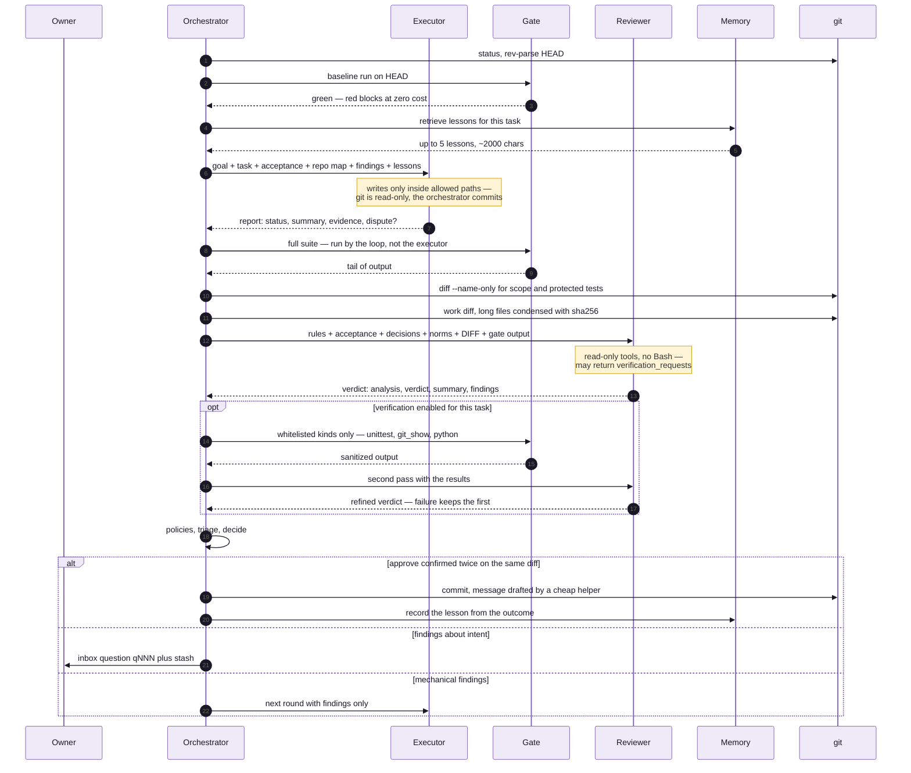

---

## 8. The verdict contract — form, meaning, rescue

A verdict is the only thing that can close a task, so its failure modes get
their own machinery (§4.2, §4.2.1). Measured on E13: **5 reviewer calls out of
17 returned no valid verdict and burned 37 % of all review money.**

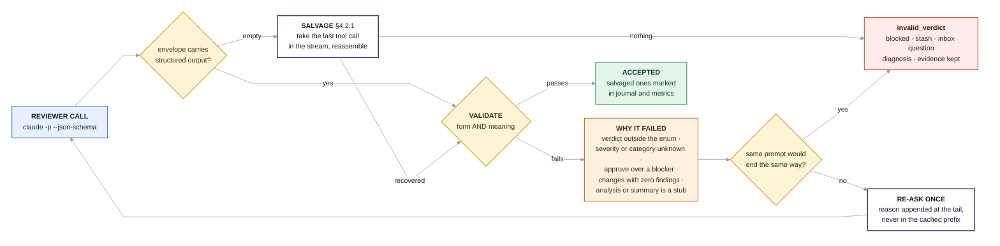

Two rules in that figure are easy to miss. **A deterministic refusal is not
retried** — a call cut off by `budget_exhausted` ends at the same place on
the second attempt, and on PILOT-1 that cost $3.23 on top of $3.37 for two
truncated calls and zero verdicts. And **the retry reason goes in the tail of
the prompt**, behind the diff: in the stable prefix it would void the cache
for the entire task.

A salvaged verdict gets no leniency: an unparsed findings list is *not* an
empty one — substituting `[]` would silently turn `request_changes` into
`approve`.

---

## 9. How an accepted verdict becomes an outcome

`verdicts.decide` applies five tests in a fixed order. The order is the
design: an approve is counted before anything else, and non-convergence is
detected before the loop is allowed to spend another round on it.

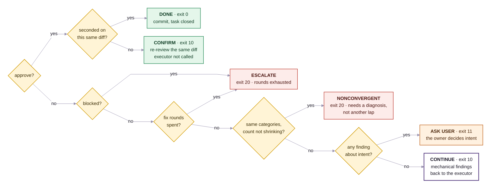

Approvals are counted **per diff hash**, not per task: an approve earned
before a later fix belongs to a different diff and does not count. Without
that rule a chain of approve → flip → fix → approve closed tasks whose final
code exactly one reviewer had ever seen.

Between rounds the loop also keeps the **best** round — the one with fewest
findings — and rolls back to it if the next is worse. Never on a confirming
round, though: there the code did not change, so a different finding count is
reviewer spread, not regression.

---

## 10. Context flow — who is told what

Context is a budget, not a courtesy (§8). Two rules shape every prompt: the
**asymmetry** that keeps the reviewer independent, and the **cache prefix**
that decides what a call costs.

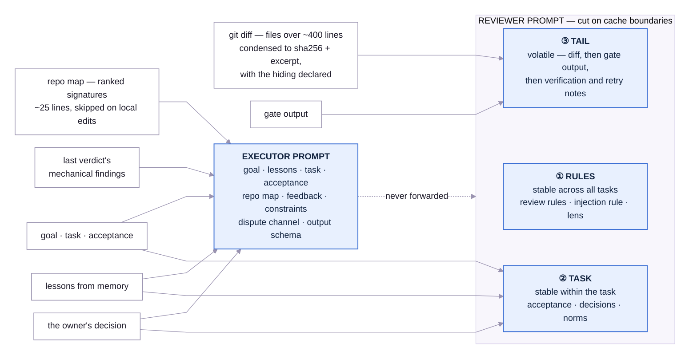

- **The executor never receives** previous handoffs or its own past
  reasoning; **the reviewer never receives** the executor's report. The dotted
  edge is the one that must stay severed (§3, §8).
- **Block order is money.** Prompt caching matches on a *prefix*: the first
  differing byte voids everything after it, a write costs twice the input
  rate, a read a tenth of it. Hence stable → task-stable → volatile, with the
  diff placed *before* the gate output because it is the largest block and
  must not sit behind anything that changes between rounds.
- **Reviewer hands are drawn by lottery** per call from
  `review_model_pool` / `review_effort_pool`, recorded in metrics
  (`swarm ab`). Because every task is reviewed twice on the same diff, the
  per-call draw produces "two hands on one diff" comparisons for free (§8.2).

---

## 11. Where the human is asked

The loop is an autopilot with a **named** list of escalations (§1.1). The
scarcest resource in the system is the owner's attention, so the triage rule
is explicit: of 6–7 findings per task, 1–2 reach the human (§5.7).

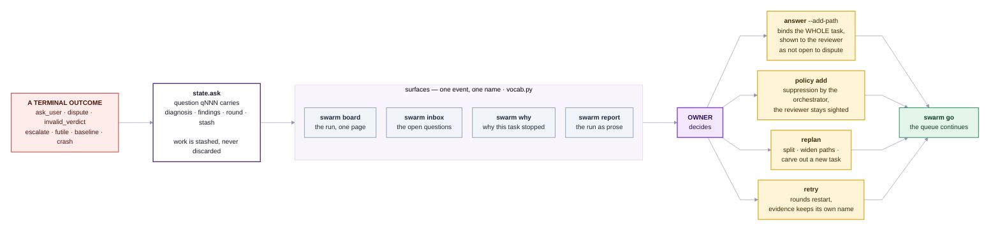

The rule the pilot paid for: **an escalation must carry a diagnosis.** A task
that goes to `blocked` with no journal entry and no question leaves the
operator blind — the work may have been finished and green, with only the
review having failed (§4.2).

---

## 12. Memory between runs (E9)

Memory is an **observation**, not part of the work: its failure leaves a trace
and never costs a run. Every path degrades — Postgres to a local file scan,
retrieval to nothing at all.

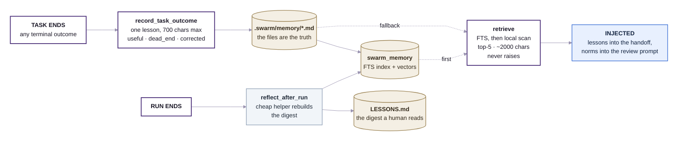

Measured effect (E9, planner arm): with memory, a replan folded all three of
the owner's decisions into named tasks, including a satellite inherited from
a different dispute; without memory that satellite was lost in every replan.

---

## 13. Failure ladder: quota, crashes, liveness

Every branch here exists because the loop once mistook one kind of failure
for another and charged the wrong party (§5.2, §5.3).

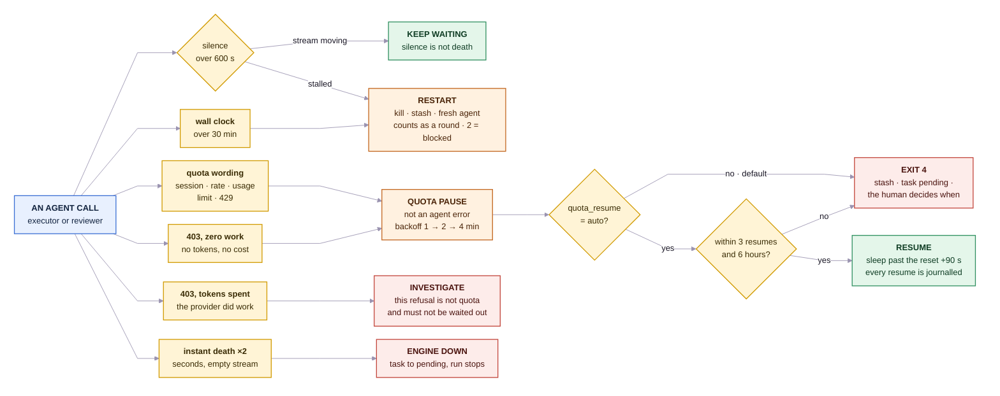

The same defect class — "a refusal by quota looks like a bad answer" — has
been fixed three times at three different levels. Read the branches above as
scar tissue, not as configuration. The distinction that took longest to
learn is the last one on the left: a 403 that spent **no** tokens is a quota
wall and joins the backoff ladder, while a 403 that **did** spend tokens is a
real refusal and must be investigated, not slept off.

---

## 14. CLI surface

One entry point, `swarm`; the commands map onto the subsystems above (§9.2).

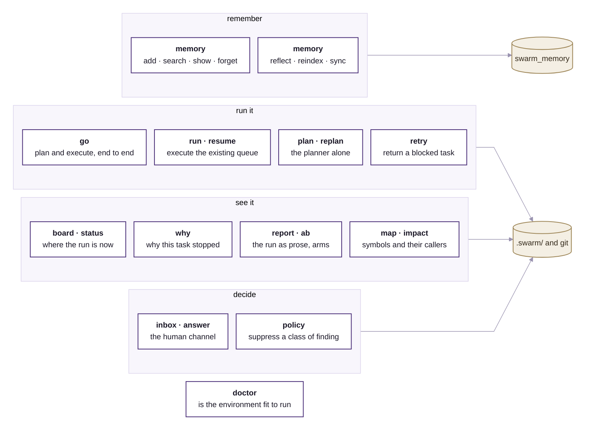

---

## Change log

### v0.2 (2026-08-23)

Diagrams redrawn for legibility after the first edition proved hard to read
at any zoom. The diagnosis was one mechanism with two symptoms: a sentence
used as an edge label is placed at the **midpoint** of its edge, so on the
long edges of a hub-and-spoke layout the text drifted into open space and
stopped belonging to anything, while the figures it bloated grew too large
to render at a readable size.

Three rules now hold across every figure. An edge label is at most three
words and names the thing handed over — the reasoning moved into the prose
beside the figure. Every edge spans **one rank**, so a label always sits
between its two endpoints. And each figure declares the same shape and
colour vocabulary, introduced by a legend in the opening section.

Structural changes from the same pass: the monolithic gate-chain figure was
split into the task frame (§3) and the round itself (§4), and the round was
turned top-to-bottom, which cut its width from 3506 px to 1184 px and let it
fit a reading column; the task state machine was split into the status flow
and a reason → remedy map (§2); the five verdict rejection rules moved off
five separate edges into one node (§8); and the failure ladder's branch
conditions became nodes instead of sentence-labels (§13).

Sixteen figures, all verified twice: rendered with `mmdc`, then measured in a
browser, where every one of the 322 node labels fits inside the box drawn for
it. Two defects were found only by that second check — Mermaid under-measures
`<b>` text, so a bold segment on a label's longest line clips, and it caps a
label at 200 px, so a longer line overflows however wide the node looks.

### v0.1 (2026-08-23)

First edition. Eleven Mermaid views drawn from `05-agent-swarm.md` v0.50 and
from the implementation in `tools/swarm/swarm/` (`loop.run_task`,
`verdicts.decide`, `gitops`, `reviewer`, `promptbuilder`, `helpers`,
`meminject`). Written in English per the owner's standing rule for new
documents; the surrounding Russian documents are untouched.
