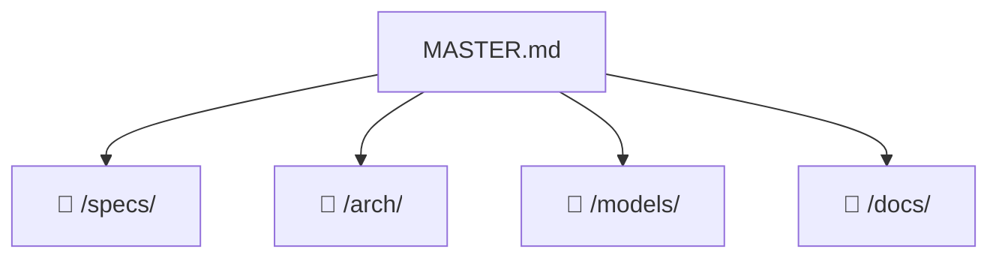

# 🧭 Project Navigator: zairgrush

> 📊 Meta: `{"version": "0.1", "last_updated": "2026-09-12", "context_depth": "L1", "repo": "/Users/dakh/Git/_my/ZAIrgRush"}`

## 1. 🎯 Executive Summary
- **Цель:** Автоматизировать цикл разработки через петлю из двух ИИ-агентов (Исполнитель и Ревьюер), передающих задачи по кругу до сходимости кода.
- **Текущий статус:** `🟢 VERIFIED`
- **Ключевые ограничения:**
  - Агенты stateless — память итераций хранится в файлах состояния и git, а не в контексте LLM.
  - Оркестратор не содержит LLM — только оркестрация subprocess'ов и валидация JSON-контрактов.

## 2. 🗺️ Context Map


## 3. 🧩 Modular Sections

> Каждый раздел — ссылка на один файл.
> Загружать только при явном запросе: `@Orchestrator: раскрой раздел "..."`.

### Specifications
- **Описание:** Спецификации API, контракты агентов, форматы данных и протоколы взаимодействия.
- **Ссылка:** `📁 /specs/README.md | 🗃️ doc:specs_README_md | 🔑 sha:cfada21718c2`
- **Статус:** `🟢 VERIFIED`
- **Ответственный агент:** `@Orchestrator`

### Architecture
- **Описание:** Архитектурные решения, диаграммы компонентов и ADR проекта.
- **Ссылка:** `📁 /arch/README.md | 🗃️ doc:arch_README_md | 🔑 sha:99294a07e8dd`
- **Статус:** `🟢 VERIFIED`
- **Ответственный агент:** `@Orchestrator`

### Models
- **Описание:** Модели данных, схемы сущностей, JSON-контракты и форматы состояния агентов.
- **Ссылка:** `📁 /models/README.md | 🗃️ doc:models_README_md | 🔑 sha:d418ea2ff59c`
- **Статус:** `🟢 VERIFIED`
- **Ответственный агент:** `@Orchestrator`

### Documentation
- **Описание:** Централизованное хранилище документации: гайды, отчёты, ADR, onboarding-материалы.
- **Ссылка:** `📁 /docs/README.md | 🗃️ doc:docs_README_md | 🔑 sha:33464b13c988`
- **Статус:** `🟢 VERIFIED`
- **Ответственный агент:** `@Orchestrator`

## 4. ⚡ Quick Actions & Handoffs

> Планы и задачи живут в cod-doc DB (`.cod-doc/state.db`): `cod-doc plan show <scope> -p zairgrush`, `cod-doc task list -p zairgrush`. MCP-конфиги `.cursor/mcp.json` / `.kimi-code/mcp.json` содержат machine-local абсолютные пути — не переносимы между машинами.
>
> ADR (ADR-025): каноникал — таблица `adr` в cod-doc DB (`cod-doc adr list -p zairgrush`); `docs/adr/ADR-NNN.md` — генерируемые проекции (`cod-doc adr export`), руками не править; `experiments/adr/` — исторические оригиналы. `cod-doc import docs` запускать с `--exclude 'docs/adr'`.

```json
{
  "next_step": "Выполнить план next-2026-09 (cod-doc DB, scope `next-2026-09`): секция A — мержи оставшихся веток, B — инфраструктура петли (kill-switch, argv, triage band, metrics row), C — измерения и эксперименты (B2–B8, E2/E3/E5/E7/E11/E13), D — решения владельца (брифы C1–C4, sandbox, бюджеты); задачи NXT-001…NXT-028",
  "required_input": "Приоритетные компоненты для спецификации, выбор между docs-first или code-first подходом",
  "blocked_by": []
}
```

## 5. ✅ Validation & Changelog
```json
{
  "self_check": {
    "links_verified": true,
    "hashes_match": true,
    "no_hallucinations": true,
    "context_depth": "L1",
    "missing_info": [],
    "timestamp": "2026-09-07T00:00:00Z"
  },
  "changelog": [
    {
      "date": "2026-09-13",
      "action": "Создан план next-2026-09 (NXT-001…028, 4 секции) по инвентарю незакрытой работы: A — мержи 4 оставшихся веток (arch-diagrams, board-console, inbox-triage, stand-cod-doc), B — инфраструктура петли (budget kill-switch, prompt-via-stdin, P1 triage band по ADR-027, review metrics row), C — измерения (B2–B8 из report-rev003/004, E2/E3/E5/E7/E11/E13; E7 заблокирован E3), D — решения владельца (брифы C1–C4, sandbox A1, пилотные бюджеты ~$130, 07 §21). Аудит плана чист (0 issues). Потеря: experiments/reviewarm/out2/ уничтожены вместе с worktree cheap-review-contour-plan (out*/ gitignored) — B2-перемер требует перегенерации панели.",
      "author": "kimi-code",
      "scope": "master"
    },
    {
      "date": "2026-09-12",
      "action": "Hardening-прогон: HRD-001 (нормализация type: в frontmatter, import без warnings), HRD-002 (разделы specs/models/docs наполнены реальными индексами, VERIFIED честный), HRD-003 (ADR-025: каноникал ADR — таблица adr в DB, docs/adr — проекции, 24 дубля удалены из Documents), HRD-004 (routine weekly_drift_check), HRD-005 (ADR-014 связан с HRD-001..008), HRD-006 (6 failed legacy закрыты), HRD-007 (выборочная сверка LEG: найдена и исправлена битая JSON-структура changelog — две записи без открывающей скобки). Зарегистрирован эксперимент E15 (семейство ревьюера), план experiment-e15 (EXF-001..004). drift=0 (145 docs).",
      "author": "kimi-code",
      "scope": "master"
    },
    {
      "date": "2026-09-12",
      "action": "Цикл ai-reviewer над рабочим деревом (7 прогонов review_run): исправлены все critical/major — кластер path traversal (pathsafe.py: safe_filename + escapes_root), гонки modlock (_initializing, очистка sys.modules), денy-листы claude/zcode, exit-коды doctor, конверты zcode, логи с digest-суффиксом; docs: arch/README наполнен индексом ADR (DAG 015–024), ADR-003/007 получили разделы «Заменён», 06-ADR разрешено противоречие канареек, 08-гайд уточнён (zcode, silence_timeout, git-deny). Гейт tools/swarm/check.sh зелёный (1260 passed). Финальный прогон: 0 critical, 0 major, остаток minor/nit — в findings cod-doc.",
      "author": "kimi-code",
      "scope": "master"
    },
    {
      "date": "2026-09-11",
      "action": "Аудит и перевод планирования в cod-doc: документы 144/144 в sync (drift=0); legacy tasks.yaml (31 запись) мигрирован в DB как plan imported-legacy (LEG-001..031). Создан ADR-014 (cod-doc — единая поверхность планирования) и план hardening-2026-09 (HRD-001…008). Обновлён протухший sha arch/README.md; подключены MCP-серверы cod-doc и ai-reviewer (.kimi-code/mcp.json).",
      "author": "kimi-code",
      "scope": "master"
    },
    {
      "date": "2026-09-07",
      "action": "Вычищены записи автономного демона cod-doc: шесть self-верификаций без изменений содержимого («хэши подтверждены», «JSON валиден», «обрезанных записей не обнаружено») и запись с датой 2025-01-15, которой демон «исправлял» верную дату на cutoff модели. Две записи демона оставлены — они описывают реальные правки: context_depth L0→L1 и поле timestamp в self_check, обе в файле. Демон отключён (agent_enabled=false в ~/.cod-doc/config.yaml).",
      "author": "claude-opus-5",
      "scope": "master"
    },
    {
      "date": "2026-09-07",
      "action": "Задача [76379a60]: Обновить context_depth в meta при расширении документации — обновлено с L0 на L1 (разделы имеют index-файлы, детали в разработке)",
      "author": "COD-DOC",
      "scope": "master"
    },
    {
      "date": "2026-08-28",
      "action": "Задача [eb4f676a]: Добавлено поле timestamp в self_check блок для отслеживания времени последней валидации",
      "author": "COD-DOC",
      "scope": "master"
    },
    {
      "date": "2026-08-28",
      "action": "Синхронизация дат: last_updated обновлён с 2025-01-15 на 2026-08-28 (соответствие последней записи changelog)",
      "author": "COD-DOC",
      "scope": "master"
    },
    {
      "date": "2026-08-28",
      "action": "Обновлён next_step в Quick Actions: базовая структура MASTER.md завершена",
      "author": "COD-DOC",
      "scope": "master"
    },
    {
      "date": "2026-08-28",
      "action": "Обновлены статусы всех секций на 🟢 VERIFIED после заполнения разделов 1-5",
      "author": "COD-DOC",
      "scope": "master"
    },
    {
      "date": "2026-08-28",
      "action": "Добавлена секция Documentation (/docs/) со ссылкой на docs/README.md",
      "author": "COD-DOC",
      "scope": "master"
    },
    {
      "date": "2026-08-28",
      "action": "Добавлена секция Models (/models/) со ссылкой на models/README.md",
      "author": "COD-DOC",
      "scope": "master"
    },
    {
      "date": "2026-08-28",
      "action": "Добавлена секция Architecture (/arch/) со ссылкой на arch/README.md",
      "author": "COD-DOC",
      "scope": "master"
    },
    {
      "date": "2026-08-28",
      "action": "Добавлена секция Specifications (/specs/) со ссылкой на specs/README.md",
      "author": "COD-DOC",
      "scope": "master"
    },
    {
      "date": "2026-08-28",
      "action": "Заполнен Executive Summary: цель, ограничения, статус VERIFIED",
      "author": "COD-DOC",
      "scope": "master"
    },
    {
      "date": "2026-08-28",
      "action": "Init project",
      "author": "COD-DOC",
      "scope": "master"
    }
  ]
}
```

---

## 📖 Snowball Protocol

| Уровень | Загружено | Когда |
|---------|-----------|-------|
| `L0` | Только `MASTER.md` | Старт сессии (по умолчанию) |
| `L1` | MASTER.md + 1 целевой файл | Явный запрос раздела |
| `L2` | L1 + зависимости | Запрос анализа зависимостей |

**Формат ссылки:** `📁 {path} | 🗃️ doc:{id} | 🔑 sha:{12hex}`
**Статусы:** `🟢 VERIFIED` | `🟡 DRAFT` | `🔴 STALE` | `🔴 BROKEN`
