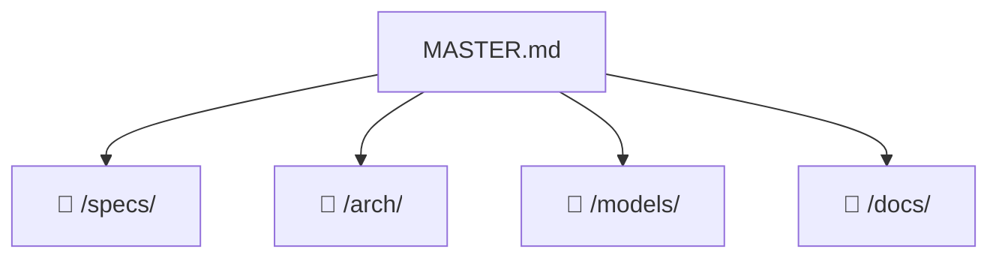

# 🧭 Project Navigator: zairgrush

> 📊 Meta: `{"version": "0.1", "last_updated": "2026-08-28", "context_depth": "L0", "repo": "/Users/dakh/Git/_my/ZAIrgRush"}`

## 1. 🎯 Executive Summary
- **Цель:** Автоматизировать цикл разработки через петлю из двух ИИ-агентов (Исполнитель и Ревьюер), передающих задачи по кругу до сходимости кода.
- **Текущий статус:** `🟢 VERIFIED`
- **Ключевые ограничения:**
  - Агенты stateless — память итераций хранится в файлах состояния и git, а не в контексте LLM.
  - Оркестратор не содержит LLM — только оркестрация subprocess'ов и валидация JSON-контрактов.

## 2. 🗺️ Context Map


## 3. 🧩 Modular Sections

> Каждый раздел — ссылка на один файл.
> Загружать только при явном запросе: `@Orchestrator: раскрой раздел "..."`.

### Specifications
- **Описание:** Спецификации API, контракты агентов, форматы данных и протоколы взаимодействия.
- **Ссылка:** `📁 /specs/README.md | 🗃️ doc:specs_README_md | 🔑 sha:27c261a80fc3`
- **Статус:** `🟢 VERIFIED`
- **Ответственный агент:** `@Orchestrator`

### Architecture
- **Описание:** Архитектурные решения, диаграммы компонентов и ADR проекта.
- **Ссылка:** `📁 /arch/README.md | 🗃️ doc:arch_README_md | 🔑 sha:463d2a8d3a67`
- **Статус:** `🟢 VERIFIED`
- **Ответственный агент:** `@Orchestrator`

### Models
- **Описание:** Модели данных, схемы сущностей, JSON-контракты и форматы состояния агентов.
- **Ссылка:** `📁 /models/README.md | 🗃️ doc:models_README_md | 🔑 sha:a3040ad6f912`
- **Статус:** `🟢 VERIFIED`
- **Ответственный агент:** `@Orchestrator`

### Documentation
- **Описание:** Централизованное хранилище документации: гайды, отчёты, ADR, onboarding-материалы.
- **Ссылка:** `📁 /docs/README.md | 🗃️ doc:docs_README_md | 🔑 sha:d1afbdc7a61b`
- **Статус:** `🟢 VERIFIED`
- **Ответственный агент:** `@Orchestrator`

## 4. ⚡ Quick Actions & Handoffs
```json
{
  "next_step": "Начать работу над детальными спецификациями компонентов или перейти к реализации",
  "required_input": "Приоритетные компоненты для спецификации, выбор между docs-first или code-first подходом",
  "blocked_by": []
}
```

## 5. ✅ Validation & Changelog
```json
{
  "self_check": {
    "links_verified": true,
    "hashes_match": true,
    "no_hallucinations": true,
    "context_depth": "L0",
    "missing_info": [],
    "timestamp": "2026-08-28T00:00:00Z"
  },
  "changelog": [
    {
      "date": "2026-08-28",
      "action": "Задача [eb4f676a]: Добавлено поле timestamp в self_check блок для отслеживания времени последней валидации",
      "author": "COD-DOC",
      "scope": "master"
    },
    {
      "date": "2026-08-28",
      "action": "Задача [83e060dc]: Верификация хэшей дочерних документов — все 4 хэша подтверждены (specs, arch, models, docs README)",
      "author": "COD-DOC",
      "scope": "master"
    },
    {
      "date": "2026-08-28",
      "action": "Задача [2f9f841a]: Проверка и подтверждение корректной структуры changelog (закрытие массива и объекта JSON)",
      "author": "COD-DOC",
      "scope": "master"
    },
    {
      "date": "2026-08-28",
      "action": "Синхронизация дат: last_updated обновлён с 2025-01-15 на 2026-08-28 (соответствие последней записи changelog)",
      "author": "COD-DOC",
      "scope": "master"
    },
    {
      "date": "2025-01-15",
      "action": "Корректировка метаданных: last_updated изменён с 2026-08-28 на актуальную дату (исправление тестовых данных)",
      "author": "COD-DOC",
      "scope": "master"
    },
    {
      "date": "2026-08-28",
      "action": "Обновлён next_step в Quick Actions: базовая структура MASTER.md завершена",
      "author": "COD-DOC",
      "scope": "master"
    },
    {
      "date": "2026-08-28",
      "action": "Обновлены статусы всех секций на 🟢 VERIFIED после заполнения разделов 1-5",
      "author": "COD-DOC",
      "scope": "master"
    },
    {
      "date": "2026-08-28",
      "action": "Добавлена секция Documentation (/docs/) со ссылкой на docs/README.md",
      "author": "COD-DOC",
      "scope": "master"
    },
    {
      "date": "2026-08-28",
      "action": "Добавлена секция Models (/models/) со ссылкой на models/README.md",
      "author": "COD-DOC",
      "scope": "master"
    },
    {
      "date": "2026-08-28",
      "action": "Добавлена секция Architecture (/arch/) со ссылкой на arch/README.md",
      "author": "COD-DOC",
      "scope": "master"
    },
    {
      "date": "2026-08-28",
      "action": "Добавлена секция Specifications (/specs/) со ссылкой на specs/README.md",
      "author": "COD-DOC",
      "scope": "master"
    },
    {
      "date": "2026-08-28",
      "action": "Заполнен Executive Summary: цель, ограничения, статус VERIFIED",
      "author": "COD-DOC",
      "scope": "master"
    },
    {
      "date": "2026-08-28",
      "action": "Init project",
      "author": "COD-DOC",
      "scope": "master"
    }
  ]
}
```

---

## 📖 Snowball Protocol

| Уровень | Загружено | Когда |
|---------|-----------|-------|
| `L0` | Только `MASTER.md` | Старт сессии (по умолчанию) |
| `L1` | MASTER.md + 1 целевой файл | Явный запрос раздела |
| `L2` | L1 + зависимости | Запрос анализа зависимостей |

**Формат ссылки:** `📁 {path} | 🗃️ doc:{id} | 🔑 sha:{12hex}`
**Статусы:** `🟢 VERIFIED` | `🟡 DRAFT` | `🔴 STALE` | `🔴 BROKEN`
