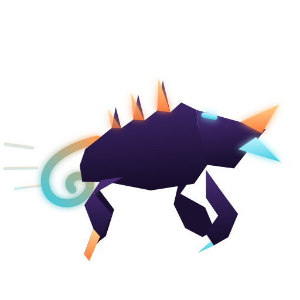

<p align="center">
  
</p>

<h1 align="center">ZAIrgRush</h1>
<p align="center"><i>Zerg Rush, только рой — это два ИИ-агента, а ранняя атака — это ваш код.</i></p>

<p align="center">
  <a href="LICENSE"></a>
  
  
</p>

---

## Что это

**ZAIrgRush** — самостоятельная реализация «роя агентов»: петли разработки,
в которой два независимых CLI-агента передают друг другу задачи по кругу,
пока код не сойдётся к принятому виду, без постоянного участия человека.

- **Исполнитель** — пишет код по задаче. Движок выбирается конфигом
  (`executor_engine`): **Kimi Code** (модель K3) по умолчанию, **Claude
  Code** — когда нужен один провайдер на весь рой или когда цену
  исполнителя надо видеть в бюджете прогона.
- **Claude Code** — ревьюер: строго read-only, смотрит только `git diff` и
  выносит структурированный verdict (severity/category по закрытому enum'у).
- Между ними — тонкий Python-оркестратор (`swarm`, ~300–500 строк): сам
  оркестратор не содержит LLM, только гоняет subprocess'ы, перекладывает
  файлы состояния и следит за стоп-условиями (бюджет, `max_iterations`,
  детект топтания). Вся «умность» — в агентах.

Агенты **stateless** — каждый вызов это свежий `kimi -p` / `claude -p`.
Память итераций живёт не в контексте, а в файлах (`.swarm/tasks.json`,
`.swarm/state.json`, `.swarm/log/`) и в git — источнике правды о коде.
Контракты обмена между ролями — строгий JSON, который оркестратор
валидирует механически: невалидный ответ = один retry, затем эскалация
человеку.

Полная архитектура, обзор альтернатив (Ralph Wiggum Loop, Gas Town,
agent-dispatch, Claude Code agent teams и др.) и обоснование решений —
в [`05-agent-swarm.md`](05-agent-swarm.md).

## Быстрый старт

```sh
git clone git@github.com:Orange-hanter/zairgrush.git
cd zairgrush/tools/swarm

# прогнать тесты
python3 -m pytest

# проверить окружение в целевом репозитории (оба CLI, ctags, чистота дерева)
./swarm-cli --root /путь/к/вашему/репо doctor

# декомпозировать цель и запустить петлю от и до эскалации
./swarm-cli --root /путь/к/вашему/репо go --goal "цель на естественном языке"
```

`swarm --help` — карта команд с порядком применения (`run`, `resume`,
`status`, `inbox`, `answer`, `retry`, `plan`, `replan`, `policy`, `why`,
`report`, `board`, `ab`, `map`, `impact`, `doctor`). Когда прогон встал —
`swarm why`: одним ответом причина, траектория раундов, вердикт ревьюера
и готовая команда разбора. Как вести разработку через петлю руками — в
[`08-operators-guide.md`](08-operators-guide.md).

## Структура репозитория

| Путь | Что там |
| --- | --- |
| [`05-agent-swarm.md`](05-agent-swarm.md) | Основной дизайн-док петли: постановка задачи, архитектура, протокол handoff, контракты (§12), план внедрения. Версионируется — см. журнал изменений в конце файла. |
| [`05-agent-swarm-audit.md`](05-agent-swarm-audit.md) | Отчёт аудита v0.4 с источниками решений, вошедших в v0.5+. |
| [`06-knowledge-infra-experiments.md`](06-knowledge-infra-experiments.md) | Программа экспериментов над знаниевой инфраструктурой: дублирующие варианты подсистем E1–E8, протокол findings/ADR, правила анти-зоопарка. |
| [`07-experiments-journal.md`](07-experiments-journal.md) | Связный человекочитаемый журнал программы экспериментов. |
| [`08-operators-guide.md`](08-operators-guide.md) | Руководство оператора: подготовка стенда, постановка задач, разбор блокировок. |
| [`09-swarm-decomposition-plan.md`](09-swarm-decomposition-plan.md) | План декомпозиции крупных модулей `tools/swarm` (`cli.py`, `loop.py`, `memory.py`, `agents.py`) без смены публичного API. |
| [`10-decision-briefs.md`](10-decision-briefs.md) | Брифы для решений «на утверждение» 05-документа: лёгкое ревью, пороги §9.1, таксономия §12 — данные программы и рекомендации. |
| [`tools/swarm/`](tools/swarm) | Реализация: CLI `swarm`, оркестратор, индексация кода (ctags/tree-sitter), JSON-схемы контрактов (`schemas/`), тесты (`pytest`). |
| [`stands/`](stands) | Готовые стенды: эталонный `swarm.toml` и порядок развёртывания под конкретный репозиторий. Первый — [`stands/cod-doc/`](stands/cod-doc/README.md). |
| [`experiments/adr/`](experiments/adr) | Принятые решения экспериментальной программы (Context → Варианты → Решение → Последствия). |
| `experiments/findings.jsonl` | Сырой журнал наблюдений по экспериментам (см. `.gitignore` — рабочие стенды в git не попадают, только выводы). |

## Статус

Проект **экспериментальный** (`draft`), активно меняется — см. `version`/
`updated` во frontmatter каждого документа и журналы изменений в их конце.
Автотесты `tools/swarm`: 1208 passed + 492 subtests (+10 skipped: tree-sitter опционален) — одна команда
`cd tools/swarm && ./check.sh` (линт → типы → тесты).

Открытые решения помечены в документах как «на утверждение» / «проект
значений» — это осознанно незакрытые вопросы, а не недосмотр.

## Лендинг

Питч проекта и схема петли одной страницей: **[orange-hanter.github.io/zairgrush](https://orange-hanter.github.io/zairgrush/)**.

## Лицензия

[MIT](LICENSE) — код `tools/swarm`. Документация (`*.md`) — тот же репозиторий,
используйте с указанием источника.
